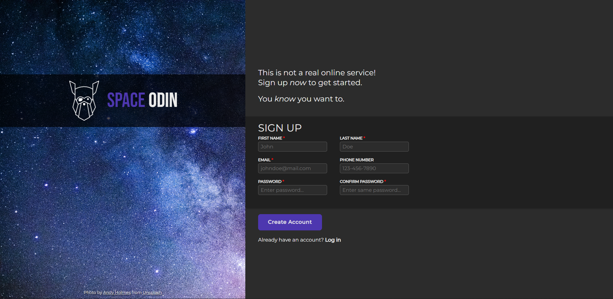
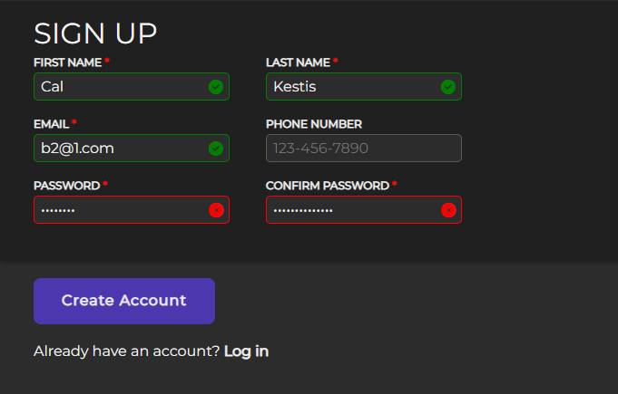

# Space Odin Signup

## Description

This project comes from [The Odin Project](https://www.theodinproject.com/) **Intermediate HTML and CSS** section. In this project, I am tasked with creating a signup page using HTML and CSS with some JavaScript logic for validation.

I chose to do all of this project without frameworks or libraries (other than [fontawesome](https://fontawesome.com/)) to take a break from tech like [bootstrap](https://getbootstrap.com/) or [tailwind](https://tailwindcss.com/), and see if I could do it myself.

The "trick" I learned about and will absolutely take with me moving forward is utilizing the `:root` CSS selector to differentiate between light mode and dark mode. I chose to use the value stored in `prefers-color-scheme` rather than make a toggle-able button, although I have since used the toggle in other projects. Example of `prefers-color-scheme` below:

```css
:root {
  --background: #fff;
  --text-primary: #242424;
  /* other "light-mode" styles */
}

@media (prefers-color-scheme: dark) {
  :root {
    --background: #2c2c2c;
    --text-primary: #fff;
  }
}
```

## Preview


